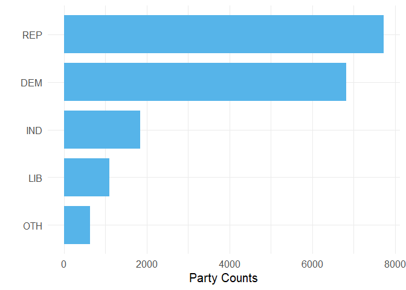
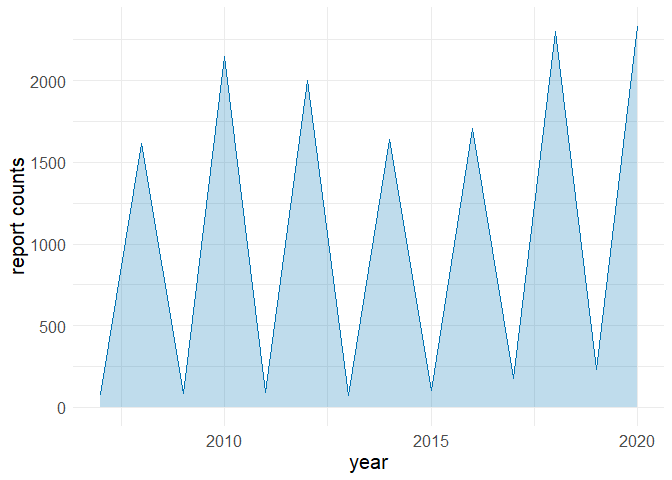

Campaign Finance Visualization
================

This is a **visual exploration** about candidate’s campaign finance data by
using several **data visualization** concepts from the book
[*Fundamentals of Data
visualization*](https://clauswilke.com/dataviz/index.html). The dataset
has 26,828 rows and 50 columns, which is a combination of candidate
summary file from year 2008 to 2020 obtained from the U.S. Federal
Election Commission ([FEC](https://www.fec.gov/)). Each summary file
covers for a two year period of candidate’s financial activity summary.
For more detailed file description, please visit:
<https://www.fec.gov/campaign-finance-data/candidate-summary-file-description/>

# Part 1. Figures with stories

In Part 1, several data representations were created along with
corresponding stories. The figures presented conveyed messages extracted
from the dataset and were useful in the exploratory data analysis
process. It is believed that, when used properly, data visualization can
help to facilitate understanding of the dataset by providing intuitive
insights.

### 1.1 Bar plot of the top 5 parties

Among the top 5 popular parties, the number of candidates affiliated
with the Republican Party and the Democratic Party significantly
outweighs (at least 300%) candidates from other political parties.
Republican and Democratic are the dominant parties in the dataset.

### 1.2 Density estimates of individual contribution

The density plot shows a bimodal distribution of total contributions
from individuals. A high density of candidates made relatively low
individual contribution around the mode compared to candidates who made
10 to 15 arcsinh units of individual contribution around the lower
density peak.

### 1.3 Sina plot of total loan from 2020 reports

For reports in 2020, candidates from popular states tend to have a total
loan located between 5 and 15 natural log of dollars, ignoring total
loan being zero. There is a significantly small data point in Florida
away from the cluster, so it can be an outlier.

### 1.4 Ending years of reports

The line graph shows the ending year of reports fluctuating between odd
years and even years. Majority reports ended in even years (e.g., 2010,
2020), and a minor portion of reports ended in odd years (e.g., 2015).

### 1.5 Geographical distribution of candidate office

California has the greatest color depth than other states, so most
candidates have their offices located in California. Also, many
candidates have their offices in Texas, Florida, or New York. But there
are less candidate offices in Alaska.

# Part 2. Misleading figures

In part 2 of this project, two figures (1.4 & 1.5) from part 1 were
transformed and presented in a way that conveyed different messages.
While these figures were technically correct, they may have been
misleading to some viewers who did not examine them carefully. This
exercise demonstrated the importance of carefully considering how data
is represented, as not all data representations can clearly convey the
intended message. By understanding the potential for figures to be
misleading, we can better avoid them in the future.

### 2.1 Log transformed ending years of reports

At a glance, the number of report ending years has little variations
from year to year. It just varies within 4 to 8 units. Although the plot
is technically right, the log transformation eases the periodic trend in
the visual representation, making fluctuations less obvious. If one
exponentiates the log unit, they will find the differences are actually
distinct.

### 2.2 Dark colored office distribution

People may naturally think California and Texas are the most popular
states of candidate offices (&gt; 2000 counts). The dark color depth
makes them hard to distinguish from one another. In fact, there are more
than 2000 offices only in California, but not in Texas. They are not in
the same category.

(All figures were created in R using packages)
